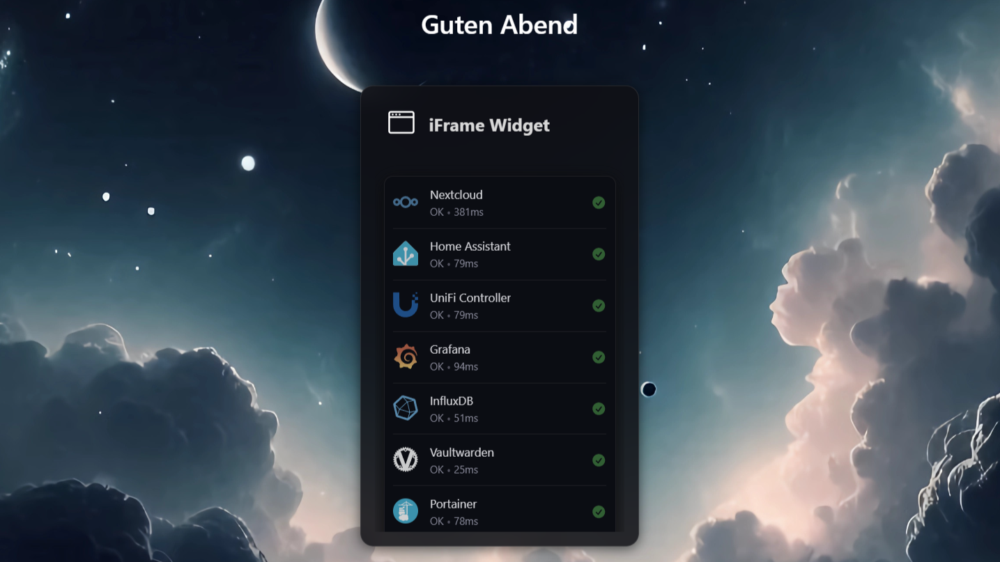

# iFrame Widget for Nextcloud

Display external websites directly in your Nextcloud dashboard with this customizable widget.<br><br><br>

<p align="center"></p>
<p align="center">In this Example i added my Glance Dashboard as an iFrame</p>

## Features

- Embed any website in your Nextcloud dashboard
- Customizable widget title
- Support for custom icons using [Simple Icons](https://simpleicons.org/) with the `si:` prefix
- Custom icon coloring
- Adjustable iframe height
- Extra-wide display option (2 columns)
- Clean, responsive design that integrates with Nextcloud themes


### TODO

- Multiuser Support
- User-specific Settings
- 3-Column Size
- Refresh Button (or Refresh Timer Option)


## Screenshots

| Widget in Dashboard | Admin Settings |
| :--: | :--: |
|  |  |

## Installation

1. Clone Repository to the "iframewidget" directory

```sh
git clone https://github.com/IT-BAER/nc-iframewidget.git iframewidget
```

2. Change file permissions

```sh
sudo chown -R www-data:www-data iframewidget
```

3. Move/Copy directory to your Nextcloud Apps Folder (default: /var/www/Nextcloud/apps/)

```sh
sudo mv iframewidget /var/www/nextcloud/apps/
```

4. (Optional) Clear Nextcloud Cache

```sh
sudo -u www-data php /var/www/nextcloud/occ maintenance:repair
```

5. Enable the App in your Nextcloud App Dashboard

## Updating

1. Clone Repository to the "iframewidget" directory

```sh
git clone https://github.com/IT-BAER/nc-iframewidget.git iframewidget
```

2. Change file permissions

```sh
sudo chown -R www-data:www-data iframewidget
```

3. Copy directory to your Nextcloud Apps Folder (default: /var/www/Nextcloud/apps/)

```sh
sudo cp -rf iframewidget/* /var/www/nextcloud/apps/iframewidget/
```

4. Remove cloned Repo after updating

```sh
sudo rm -r iframewidget
```


## Configuration

Access the widget settings from:

1. Settings → Administration → iFrame Widget
2. Configure the following options:
    - **Widget Title**: Set a custom title (or leave empty to hide the header)
    - **Widget Icon**: Enter an icon name with `si:` prefix (e.g., `si:github`)
    - **Icon Color**: Choose a custom color for the icon
    - **URL to Display**: The website URL to embed
    - **iFrame Height**: Set a fixed height or use 100% (default)
    - **Extra Wide**: Toggle to span two dashboard columns

## Icon System

This widget uses Simple Icons for custom icons:

`si:iconname`

For example:

- `si:github` - GitHub icon
- `si:youtube` - YouTube icon
- `si:nextcloud` - Nextcloud icon

Browse available icons at [SimpleIcons.org](https://simpleicons.org/).

## Requirements

- Nextcloud 30+
- Git
- Website to be embedded must allow iframe embedding (not all sites do)
- Content Security Policy (CSP) configuration to allow external domains in iframes


### CSP Configuration

By default, Nextcloud restricts which websites can be embedded in iframes for security reasons. To embed external websites in your dashboard widget, you'll need to add them to your server's Content Security Policy configuration:

#### For Apache

Add the following to your Apache configuration or .htaccess file:

```apache
# Allow specific domain in iframes
Header set Content-Security-Policy "frame-src 'self' https://example.com;"

# If you need to allow multiple domains
Header set Content-Security-Policy "frame-src 'self' https://example.com https://another-site.org;"
```


#### For Nginx

Add the following to your Nginx server block:

```nginx
# Allow specific domain in iframes
add_header Content-Security-Policy "frame-src 'self' https://example.com;";

# If you need to allow multiple domains
add_header Content-Security-Policy "frame-src 'self' https://example.com https://another-site.org;";
```


### Note on External Websites

Some websites explicitly block being embedded in iframes using their own CSP headers (`X-Frame-Options: DENY` or `frame-ancestors: 'none'`). These sites cannot be embedded even if you configure your server correctly. In these cases, consider using the External Sites app with the redirect option instead.

## Security Notes

- Websites embedded through iframes operate within their own security context
- Some websites block embedding using X-Frame-Options headers
- Use trusted sources for embedded content


## License

This project is licensed under the [AGPL-3.0-or-later](LICENSE) license.

## Credits

- [Simple Icons](https://simpleicons.org/) - Used for widget icons

