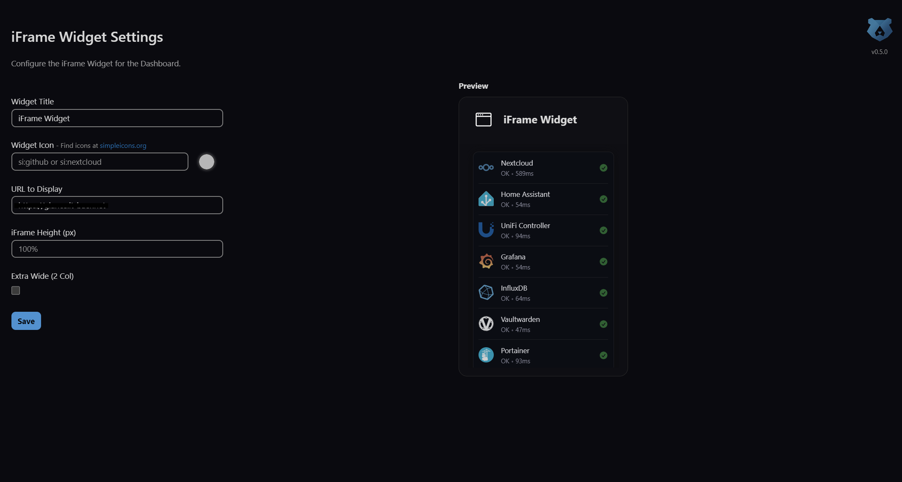

# 🖼️ iFrame Widget for Nextcloud

<div align="center">


**Display external websites directly in your Nextcloud dashboard with customizable widgets**


</div>

## ✨ Features

- **Embed any website** in your Nextcloud dashboard using iframes
- **Multiple widget types**: Public (admin-configured), Personal (user-configured), and Group-based widgets
- **5 public widget slots** for admin-configured widgets visible to all users
- **5 group widget slots** for group-specific content delivery
- **1 personal widget** per user for individual customization
- **Custom icons** via [Simple Icons](https://simpleicons.org/) using `si:` prefix (3000+ brand icons)
- **Icon color picker** for custom icon colors
- **Adjustable iframe height** or automatic sizing
- **Extra-wide display** option (spans 2 dashboard columns)
- **Configurable iframe security** with sandbox and allow attribute customization
- **Hide widget header** by leaving title empty
- **Multi-language support** with 15 translations

## 🚀 Roadmap

Future planned features:
- 3-column widget size option
- Refresh button and auto-refresh timer
- Additional language translations
- Enhanced widget management UI (drag & drop, categories)

## 📸 Screenshots

<div align="center">

**Widget in Dashboard**


<br><br>

**Admin Settings**



</div>

## ⚙️ Configuration

### Admin/Public Widgets

Configure public widgets from **Settings → Administration → iFrame Widget**:

| Setting | Description |
|---------|-------------|
| Widget Title | Display title (leave empty to hide header) |
| Widget Icon | Icon using `si:` prefix (e.g., `si:github`) |
| Icon Color | Custom hex color for the icon |
| URL to Display | The website URL to embed |
| iFrame Height | Fixed height in pixels or auto (default) |
| iFrame Sandbox | Security sandbox attributes for the iframe |
| iFrame Allow | Feature policy (e.g., `microphone camera fullscreen`) |
| Extra Wide | Span two dashboard columns |

Public widgets appear on all users' dashboards.

### Personal Widget

Each user can configure their own widget from **Settings → Personal → iFrame Widget**:

- Same configuration options as public widgets
- Visible only to the user who configured it
- Independent from admin-configured widgets

### Group Widgets

Create widgets for specific user groups from **Settings → Administration → iFrame Widget**:

1. Scroll to "Group-based iFrame Widgets" section
2. Select a group from the dropdown
3. Configure widget settings (same options as public widgets)
4. Save to make the widget visible to group members

You can configure up to 5 group widgets. Each widget can target a different user group.

## 🎰 Widget Slots

The app provides a slot-based architecture:

| Widget Type | Slots Available | Visibility |
|-------------|-----------------|------------|
| Public | 5 slots | All users |
| Group | 5 slots | Members of selected group |
| Personal | 1 slot per user | Individual user only |

Users can enable any combination of these widgets on their dashboard using the "+" customization button.

## 🎨 Icon System

This widget uses [Simple Icons](https://simpleicons.org/) for brand icons:

```
si:iconname
```

Examples:
- `si:github` - GitHub icon
- `si:youtube` - YouTube icon  
- `si:nextcloud` - Nextcloud icon
- `si:slack` - Slack icon

Browse 3000+ available icons at [simpleicons.org](https://simpleicons.org/).

## 📋 Requirements

- Nextcloud 30, 31, 32, or 33
- Website must allow iframe embedding (some sites block this)
- CSP configuration may be required for external domains

## 🌍 Translations

Currently supported languages:

| Language | Code | Language | Code |
|----------|------|----------|------|
| English | en | Portuguese | pt |
| German | de | Brazilian Portuguese | pt_BR |
| French | fr | Chinese (Simplified) | zh_CN |
| Spanish | es | Japanese | ja |
| Italian | it | Czech | cs |
| Dutch | nl | Swedish | sv |
| Russian | ru | Norwegian Bokmål | nb |
| Polish | pl | | |

Contribute translations via the [translation guide](docs/TRANSLATING.md).

## 🔒 CSP Configuration

Nextcloud restricts iframe embedding by default. To embed external websites, configure your server's Content Security Policy.

> **Important**: Extend the existing CSP rather than replacing it to avoid breaking other security features.

### Apache (Recommended: extend existing frame-src)

Add to your Apache configuration or `.htaccess`:

```apache
# Safely extend existing frame-src
Header always edit Content-Security-Policy "(^|;\\s*)frame-src\\s+([^;]+)" \
   "$1frame-src \\2 https://example.com https://another-site.org"
```

Or to set a complete CSP:

```apache
Header set Content-Security-Policy "frame-src 'self' https://example.com https://another-site.org;"
```

### Nginx

```nginx
add_header Content-Security-Policy "frame-src 'self' https://example.com https://another-site.org;";
```

### Note on External Websites

Some websites explicitly block iframe embedding using `X-Frame-Options: DENY` or `frame-ancestors: 'none'`. These sites cannot be embedded regardless of your CSP configuration. Consider using the External Sites app with redirect option instead.

## 🛡️ Iframe Security Settings

Version 0.9.0 adds customizable iframe security attributes:

### Sandbox Attribute

Controls iframe restrictions. Default: `allow-same-origin allow-scripts allow-popups allow-forms`

Common values:
- `allow-same-origin` - Allow same-origin policy
- `allow-scripts` - Allow JavaScript execution
- `allow-popups` - Allow popups
- `allow-forms` - Allow form submission
- `allow-modals` - Allow modal dialogs

### Allow Attribute (Feature Policy)

Controls browser feature access. Default: empty (no additional permissions)

Common values for VOIP/video apps:
- `microphone` - Microphone access
- `camera` - Camera access
- `fullscreen` - Fullscreen mode
- `autoplay` - Media autoplay
- `display-capture` - Screen capture

Example for a VOIP application:
```
microphone camera fullscreen
```

## 🔐 Security Notes

- Embedded websites operate in their own security context
- Use trusted sources for embedded content
- The sandbox attribute provides additional isolation
- CSP configuration is managed server-side for security

## ❓ FAQ

### Widget doesn't appear on dashboard

1. Add the widget using the "+" button in dashboard customization
2. Check browser console for JavaScript errors
3. Verify the app is enabled: `php occ app:list | grep iframe`

### Personal widget settings won't save (after upgrade)

Try these solutions:

```bash
# Clear Nextcloud cache
php occ maintenance:mode --on
php occ memcache:clear
php occ maintenance:mode --off

# Restart web server (Apache)
sudo systemctl restart apache2

# Or for Nginx
sudo systemctl restart nginx
sudo systemctl restart php-fpm

# Re-enable the app
php occ app:disable iframewidget
php occ app:enable iframewidget
```

### What's the difference between widget types?

| Type | Configured By | Visible To |
|------|---------------|------------|
| Public | Administrator | All users |
| Personal | Individual user | That user only |
| Group | Administrator | Members of selected group |

All types can be used simultaneously. Users add widgets to their dashboard via the "+" customization button.

## 💜 Support Development

If this project helps you, consider supporting this and future work, which heavily relies on coffee:

<div align="center">
<a href="https://www.buymeacoffee.com/itbaer" target="_blank"></a>
<br>
<a href="https://www.paypal.com/donate/?hosted_button_id=5XXRC7THMTRRS" target="_blank">Donate via PayPal</a>
</div>

## 📄 License

This project is licensed under the [AGPL-3.0-or-later](LICENSE) license.

## 👏 Credits

- [Simple Icons](https://simpleicons.org/) - Used for widget icons

